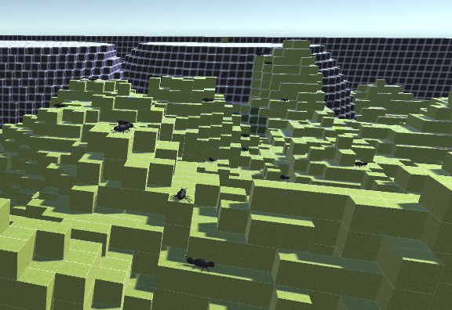
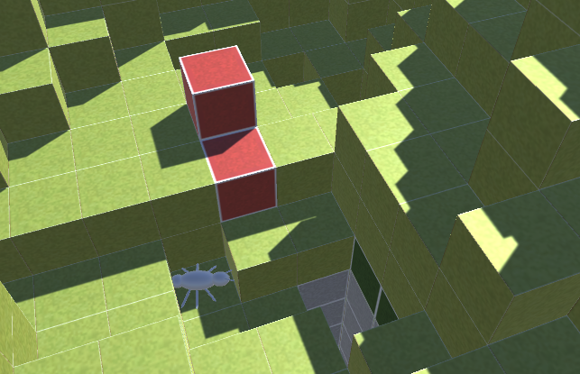

# CPSC Assignment 3: Antymology

This assignment explores the concepts of emergent behaviour and evolutionary programming. Ants can display complex behaviour from simple rules, and this simulation attempts to emulate that. In this simulation, we follow ants over multiple generations learn how to better interact with their environment in order to maximize nest production.

### Simulation World
The ants interact with a randomly-generated world made of various kinds of blocks; from mulch blocks that ants can dig up to replenish health

to Acidic blocks that damage any ants standing on them.

At the center of the world the queen can be found, the only ant capable of building nest blocks.

The Queen consumes her own health to build blocks and can't dig mulch, so she'll need help from her worker ants to build the nest. She also releases a pheromone that helps to lead other ants towards her.

### Ant behaviour and Evolutionary Strategy

Each ant will decide on their next action every 0.25 seconds. To do this, the ant will ask itself these questions:
- What kind of block am I standing on?
- Are there any ants near me?
- Am I next to the Queen?
- Can I smell the Queen's pheromones?
- How much health do I have?

The ant takes all of these environmental factors into account when deciding what to do next. The ants have 4 possible actions to take:
- Move in the direction of pheromones
- Move randomly to explore the world
- Heal other ants standing next to them
- Dig up the block they are currently standing on

The ant processes these environmental inputs and make a decision using a simple neural network. This network places weights on different combinations environmental factors, and outputs a probability of taking any of the four above actions. These weights are the "genes" of the ant, and are what are modified as we make new generations of ants. Half of the ant population is selected at the end of each generation's evaluation phase based on how much they contribute to nest construction. These ants will be selected to move on to the next generation, and will breed with other ants to increase the diversity of model weights. In order to further increase variation, genes can also randomly mutate. Through this process, the ants should be able to improve their abilities to navigate their environment and allow the nest to grow even more.